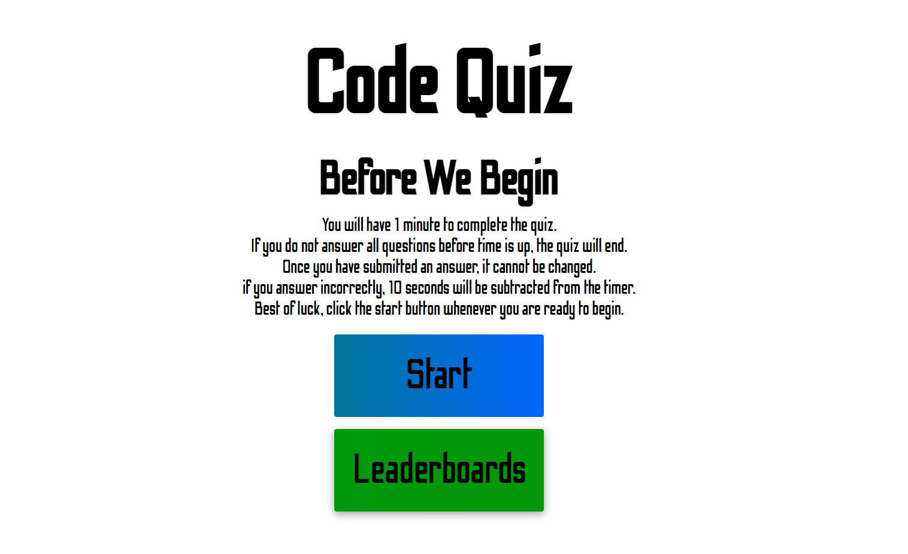
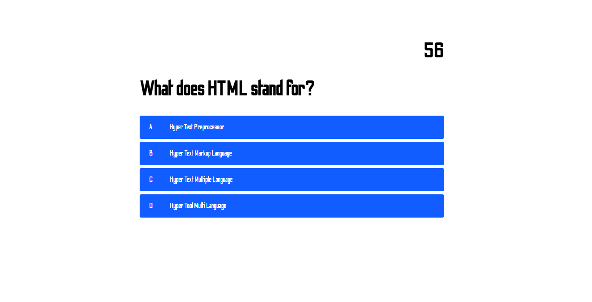
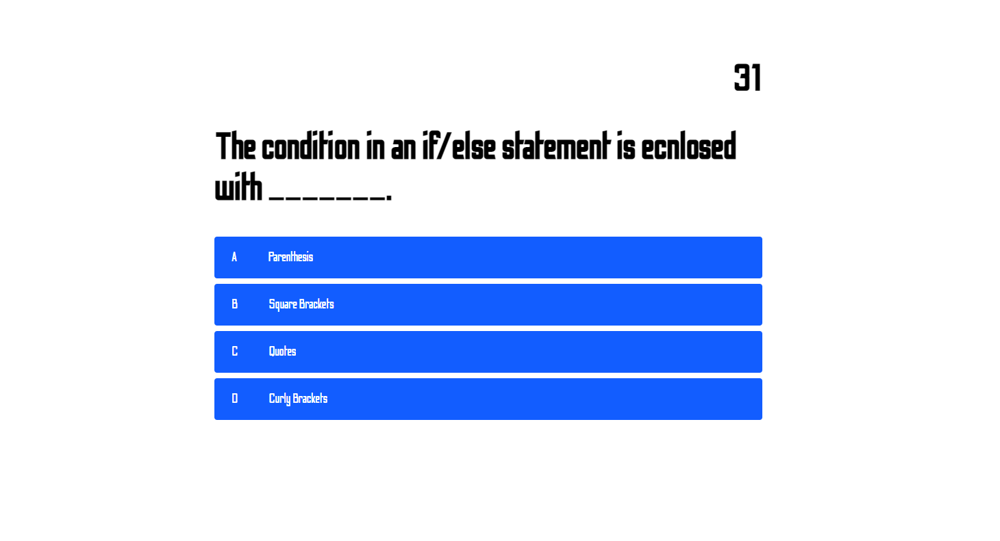
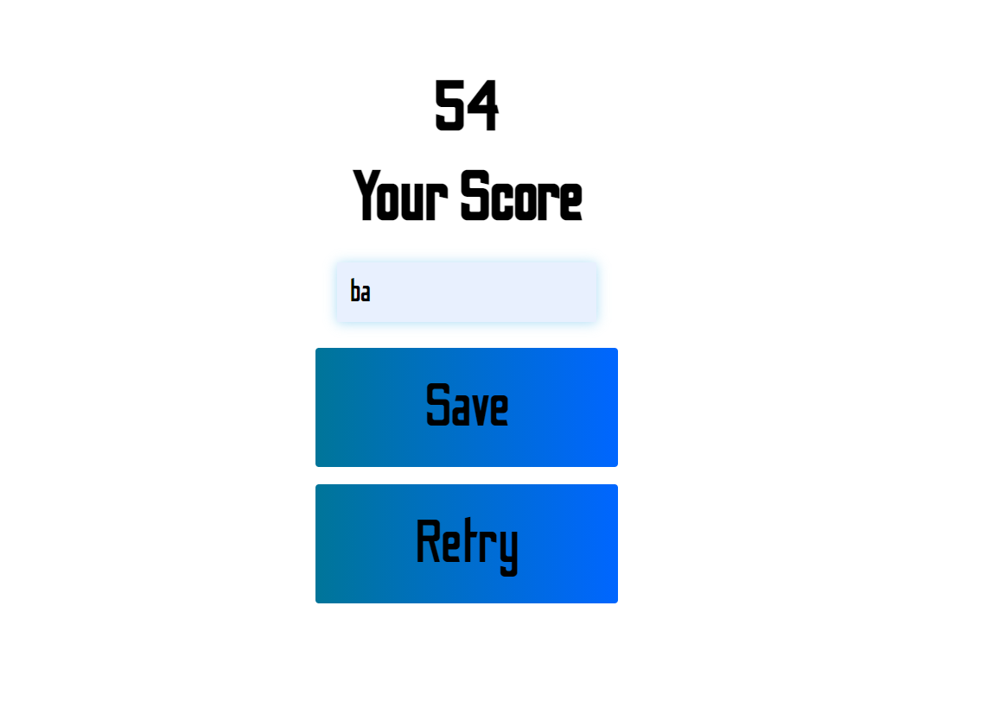

# CodeQuiz

## Purpose

To create a timed quizz to put my javascript skills to the test

## Installation

[You can pull the link to my portfolio from here:](https://github.com/BA1bers/CodeQuiz.git)

[My portfolio is published here:](https://ba1bers.github.io/CodeQuiz/)

## Website Screenshots

## Built with
    * Javascript
    * HTML
    * CSS
## Made by:

Brent Albers
